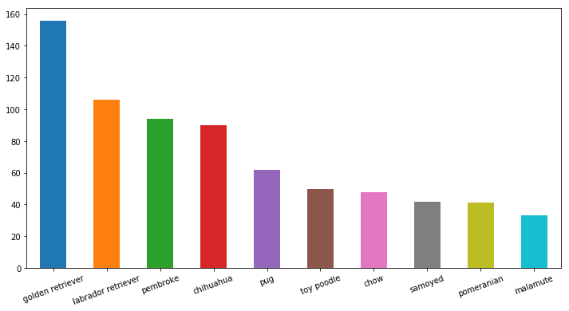
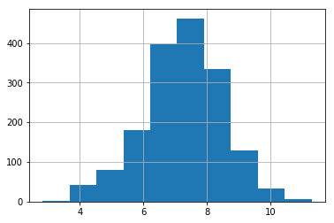
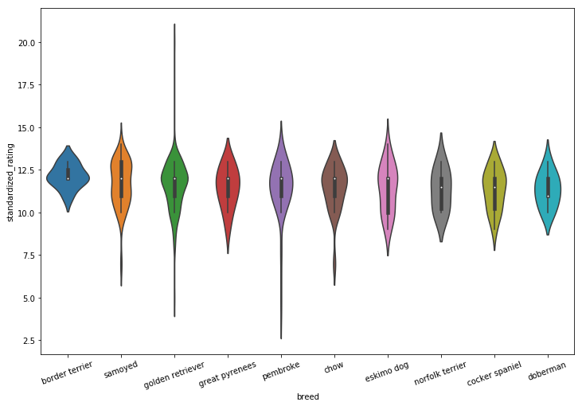
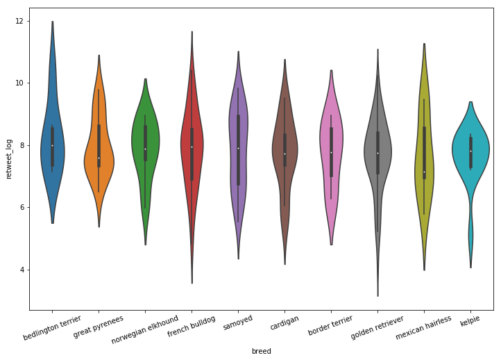
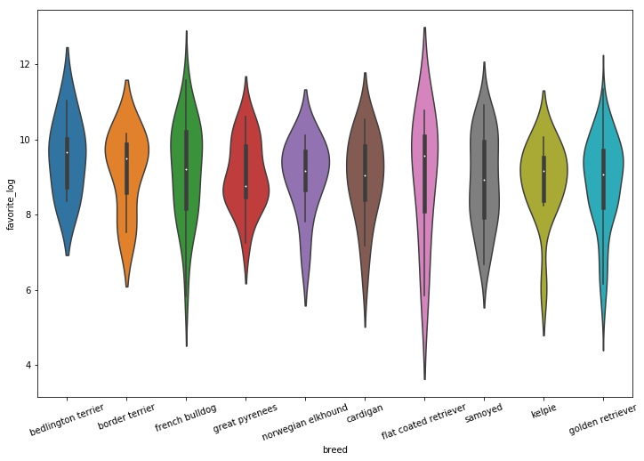
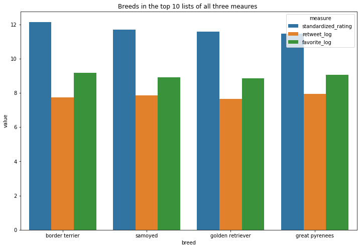
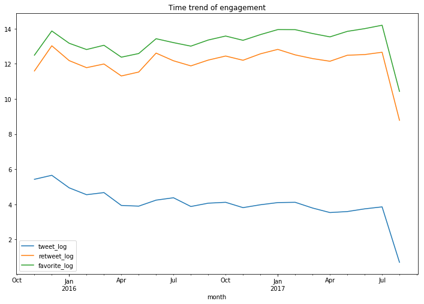
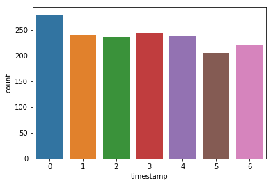
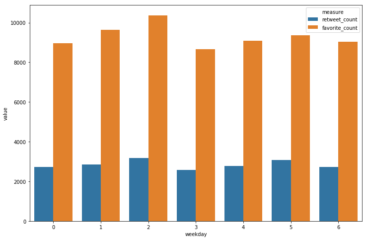
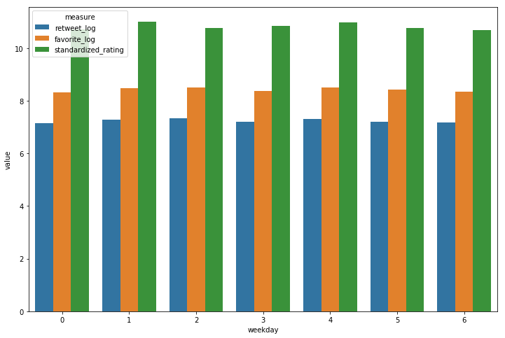

# Project: Wrangle and Analyze Data

## Act report

In this report, we are going to explore the following three topics:

1. The most popular dog breeds;
2. The Time trend of twitter engagement;
3. The Best timing of posting a tweet.

### Background information

**WeRateDogs** is a [Twitter](https://en.wikipedia.org/wiki/Twitter) account that rates people's [dogs](https://en.wikipedia.org/wiki/Dog) with a humorous comment about the dog. The account was started in 2015 by college student Matt Nelson, and has received international media attention both for its popularity and for the attention drawn to [social media](https://en.wikipedia.org/wiki/Social_media) [copyright law](https://en.wikipedia.org/wiki/Copyright_law) when it was suspended by Twitter for breaking these aforementioned laws.

Source: Wikipedia.

### What dog breeds are the most popular?

Let us first take a look at each dog breed's number of tweets.

It can been seen that golden retriever is the most popular dog breed as it gets a total of more than 150 tweets, way higher than the second one on the list. However, this indicator sounds more like a measure of prevalence. Many people love Ferrari, but most of them can only afford a Toyota. Maybe this is an improper metaphor, but a similar issue may exist here. In what follows, I will use `rating`, `retweet count`, and `favorite count` to measure popularity.

To perform our analysis, we need some housekeeping work. First, I standardize all rating to a base of 10 and put a cap of 20, because the original rating denominators have a wide range. In addition to the ratings, we also consider retweets and favorites as alternative measures of popularity. Since these two numbers all highly skewed, a log transformation is preferred. The histogram plot of logged retweet numbers is presented below, 

which has a nice bell-shape. The data looks like this:

<table border="1" class="dataframe">
  <thead>
    <tr style="text-align: right;">
      <th>breed</th>
      <th>retweet_log</th>
      <th>favorite_log</th>
      <th>standardized_rating</th>
      <th>count</th>
    </tr>
  </thead>
  <tbody>
    <tr>
      <th>afghan hound</th>
      <td>8.468199</td>
      <td>9.616398</td>
      <td>9.666667</td>
      <td>3</td>
    </tr>
    <tr>
      <th>airedale</th>
      <td>6.840938</td>
      <td>7.986674</td>
      <td>9.833333</td>
      <td>12</td>
    </tr>
    <tr>
      <th>american staffordshire terrier</th>
      <td>7.425679</td>
      <td>8.707237</td>
      <td>10.312500</td>
      <td>16</td>
    </tr>
    <tr>
      <th>appenzeller</th>
      <td>7.154701</td>
      <td>8.628749</td>
      <td>11.000000</td>
      <td>2</td>
    </tr>
    <tr>
      <th>australian terrier</th>
      <td>7.578673</td>
      <td>8.810274</td>
      <td>11.500000</td>
      <td>2</td>
    </tr>
  </tbody>
</table>

Some breeds have only a few observations, so their average rating could incur large sampling error. Thus, I only consider breeds with at least 5 tweets; the number 5 is an arbitrary choice. However, this deletion could potentially throw valuable information away: rare breeds tend to be more popular.

Here, I plot the top 10 breeds for `rating`, `logged number of retweets`, and `logged number of favorite` respectively. I use the violin plot to show the distribution within the breed.

Finally, we pick out the breeds who are on the top 10 list for all three measures. They are **border terrier**, **samoyed**, **golden retriever**, and **great pyrenees**.

<table border="1" class="dataframe">
  <thead>
    <tr style="text-align: right;">
      <th></th>
      <th>breed</th>
      <th>standardized_rating</th>
      <th>retweet_log</th>
      <th>favorite_log</th>
    </tr>
  </thead>
  <tbody>
    <tr>
      <th>0</th>
      <td>border terrier</td>
      <td>12.142857</td>
      <td>7.722305</td>
      <td>9.165118</td>
    </tr>
    <tr>
      <th>1</th>
      <td>samoyed</td>
      <td>11.690476</td>
      <td>7.836991</td>
      <td>8.911207</td>
    </tr>
    <tr>
      <th>2</th>
      <td>golden retriever</td>
      <td>11.584499</td>
      <td>7.656583</td>
      <td>8.860655</td>
    </tr>
    <tr>
      <th>3</th>
      <td>great pyrenees</td>
      <td>11.466667</td>
      <td>7.950273</td>
      <td>9.048692</td>
    </tr>
  </tbody>
</table>

Hence, I conclude that these four breeds are the most popular breeds in WeRateDogs. 

### Time trend of user engagement

This activity lasted for a long time. Our sample alone covers a span of two years. So it is interesting to see how active the participants were over time. 

Here, I aggregate the data to a monthly frequency. It seems their is no obvious trend in any of the three indicators I used. So this activity's fan base is relatively stable.

### What is the best timing of posting a tweet?

If a participant wants to get a higher rate and more retweets, on which day of the week should she tweet? Tweeting at the right time may bring more attentions and a higher rating.

Here, I only explore the weekday effect. Similar questions could be raised regarding other aspects of timing, like at which hour during a day. I first plot the average tweet numbers for each weekday.

Here, 0 represents Monday and 6 represents Sunday. Monday, on average, has more tweets posted. 

Then what about retweets and favorites? 

It seems tweeting on Wednesday can get a higher number of retweet and favorite. However, this results could be driven by some extreme cases because we are using the arithmetic mean. Let's take a look at the average of log and ratings.

Now the advantage of Wednesday is gone. It seems there is no difference between different weekdays. Maybe next time, we could try a different dimension, like at what time of a day.

### Summary

In this section, we have explored three topics:
1. What dog breeds are the most popular
2. The Time trend of twitter engagement
3. Best timing of posting a tweet

We find that

1. **border terrier**, **samoyed**, **golden retriever**, and **great pyrenees** are the 4 most popular dog breeds.
2. There is no apparent trend in user engagement. The fan base is rather stable.
3. It seems tweeting on Monday does not make much difference from any other day of the week. This dimension is probably no so important; however, other dimensions has yet to be explored.