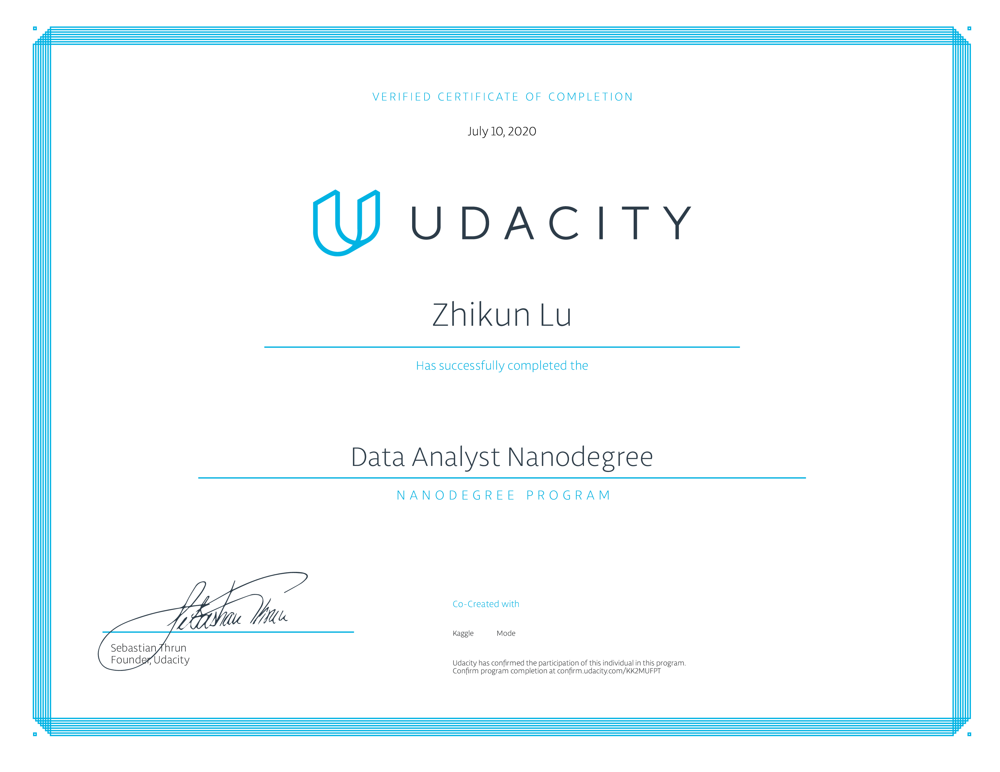

# Udacity Nanodegree Program: Data Analyst

Data Analysis with Python and SQL

## Project overview

This nanodegree program contains 5 data analysis projects.

### P1: Explore Weather Trends

### P2: Investigate a Soccer Database

### P3: Analyze AB Test Results

### P4: Wrangle and Analyze Twitter Data 

### P5: Exploration of the Ford GoBike System Data

Details to be added.

## Program Syllabus

### PART 1 Welcome to the Nanodegree program!

Welcome to the program! In this part, you’ll get an orientation into using our classroom and services. You’ll also get advice for making the best use of your time while enrolled in this program.

- Project: Explore Weather Trends

Estimated time: 6 days

### PART 2 Introduction to Data Analysis

Learn the data analysis process of questioning, wrangling, exploring, analyzing, and communicating data. Learn how to work with data in Python using libraries like NumPy and Pandas.

- Project: Investigate a Dataset

Estimated time: 23 days

### PART 3 Practical Statistics

Learn how to apply inferential statistics and probability to important, real-world scenarios, such as analyzing A/B tests and building supervised learning models.

- Project: Analyze A/B Test Results
- Project: Optimize Your GitHub Profile

Estimated time: 25 days

### PART 4 Data Wrangling

Learn the data wrangling process of gathering, assessing, and cleaning data. Learn how to use Python to wrangle data programmatically and prepare it for deeper analysis.

- Project: Wrangle and Analyze Data
- Project: Improve Your LinkedIn Profile

Estimated time: 24 days

### PART 5 Data Visualization

Learn to apply sound design and data visualization principles to the data analysis process. Learn how to use analysis and visualizations to tell a story with data.

- Project: Communicate Data Findings

Estimated time: 30 days